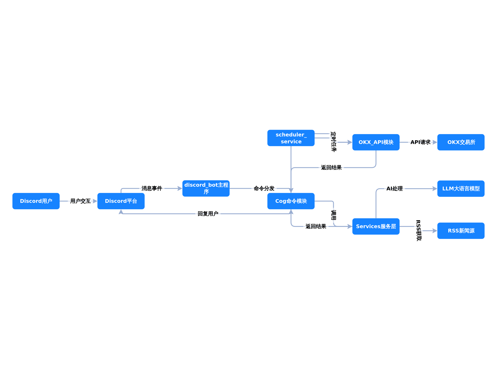
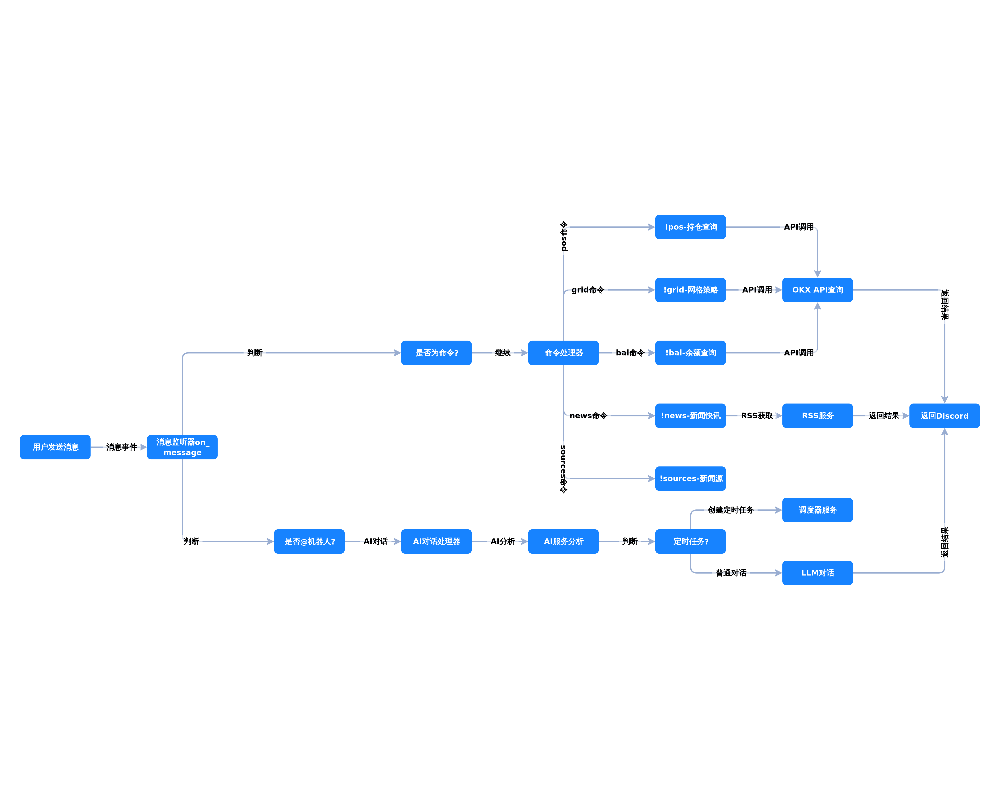
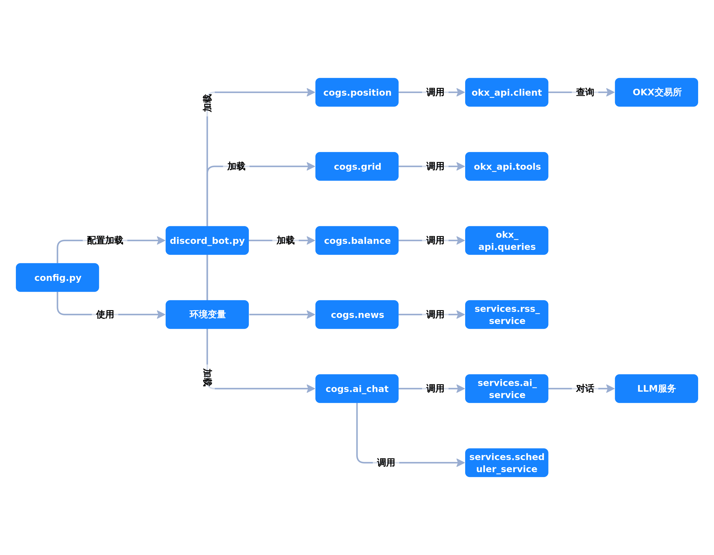
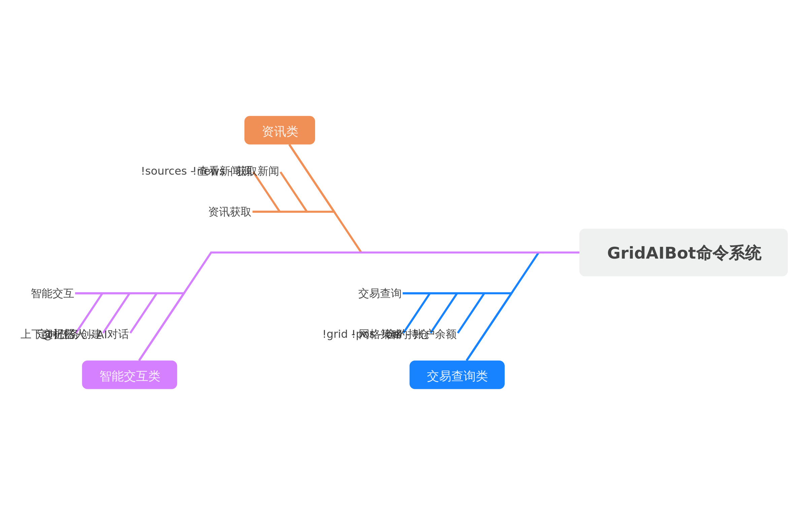
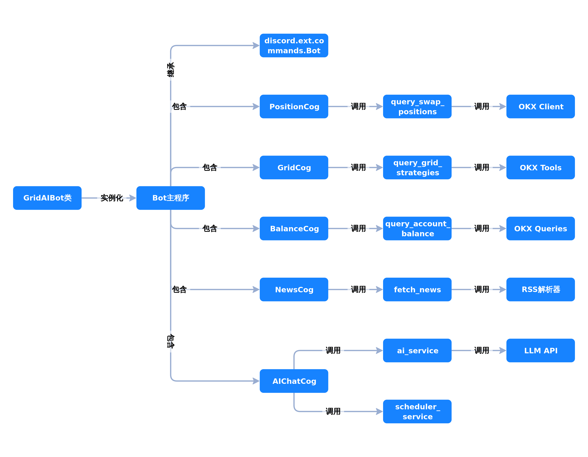

# GridAIBot

一个基于 Discord 的智能交易助手机器人，集成 OKX 交易所 API 和 AI 对话功能。

## 功能特性

- **持仓查询** - 查询 OKX 合约持仓信息
- **网格策略** - 查询合约网格策略状态
- **账户余额** - 查询账户资产余额
- **K线数据** - 查询交易对K线行情
- **新闻快讯** - 获取加密货币行业新闻
- **AI 对话** - @机器人 进行智能对话，支持上下文记忆

## 命令列表

| 命令 | 说明 |
|------|------|
| `!pos` | 查询当前合约持仓 |
| `!grid` | 查询合约网格策略 |
| `!bal` | 查询账户余额 |
| `!news [数量]` | 获取加密货币新闻快讯 |
| `!sources` | 显示可用的新闻源 |
| `@机器人` | 与 AI 进行智能对话 |
## 技术栈

- **Python 3.13+**
- **discord.py** - Discord Bot 框架
- **python-okx** - OKX 交易所 API
- **LangChain** - LLM 应用框架
- **OpenAI API** - AI 对话接口
- **feedparser** - RSS 新闻解析

## 项目架构图

### 系统架构图


### 消息处理流程图


### 模块依赖关系图


### 命令功能分类图


### 类与组件关系图


## 本地开发

### 环境要求

- Python 3.13+
- uv 包管理器

### 安装步骤

1. 克隆仓库
```bash
git clone https://github.com/Ibook000/GridAIBot.git
cd GridAIBot
```

2. 安装依赖
```bash
uv sync
```

3. 配置环境变量
```bash
cp .env.example .env
```

编辑 `.env` 文件，填入你的配置：
```env
# Discord Bot 配置
DISCORD_BOT_TOKEN=your_discord_bot_token

# OKX API 配置
OKX_API_KEY=your_okx_api_key
OKX_API_SECRET=your_okx_api_secret
OKX_PASSPHRASE=your_okx_passphrase
OKX_BASE_URL=https://www.okx.com
OKX_FLAG=0

# LLM 配置
LLM_BASE_URL=https://apis.iflow.cn/v1
LLM_API_KEY=your_llm_api_key
LLM_MODEL=qwen3-max
```

4. 运行机器人
```bash
uv run python discord_bot.py
```

## 服务器部署

详细部署指南请查看 [deploy/README.md](deploy/README.md)

### 快速部署

```bash
# 上传项目到服务器
rsync -avz --exclude='.venv' --exclude='__pycache__' --exclude='.git' ./ user@server:/tmp/GridAIBot/

# 运行安装脚本
cd /tmp/GridAIBot
chmod +x deploy/install.sh
sudo ./deploy/install.sh

# 配置环境变量
sudo nano /opt/gridaibot/.env

# 启动服务
sudo systemctl start gridaibot
```

### 服务管理

```bash
# 查看状态
sudo systemctl status gridaibot

# 查看日志
sudo journalctl -u gridaibot -f

# 重启服务
sudo systemctl restart gridaibot
```

## 项目结构

```
GridAIBot/
├── cogs/                   # Discord 命令模块
│   ├── ai_chat.py         # AI 对话功能
│   ├── balance.py         # 余额查询
│   ├── grid.py            # 网格策略查询
│   ├── news.py            # 新闻快讯
│   └── position.py        # 持仓查询
├── okx_api/               # OKX API 模块
│   ├── client.py          # API 客户端管理
│   ├── queries.py         # 数据查询封装
│   └── tools.py           # LangChain 工具
├── services/              # 业务服务
│   ├── ai_service.py      # AI 服务封装
│   └── rss_service.py     # RSS 新闻服务
├── deploy/                # 部署相关文件
│   ├── gridaibot.service  # systemd 服务配置
│   ├── install.sh         # 安装脚本
│   └── README.md          # 部署指南
├── config.py              # 配置管理
├── discord_bot.py         # Bot 入口
├── pyproject.toml         # 项目配置
└── .env.example           # 环境变量示例
```

## 获取 API 密钥

### Discord Bot Token

1. 访问 [Discord Developer Portal](https://discord.com/developers/applications)
2. 创建新应用，进入 Bot 页面
3. 点击 "Add Bot" 创建机器人
4. 复制 Token

### OKX API

1. 登录 OKX 账户
2. 进入 API 管理页面
3. 创建 API Key，设置权限
4. 保存 API Key、Secret 和 Passphrase

## 许可证

MIT License
